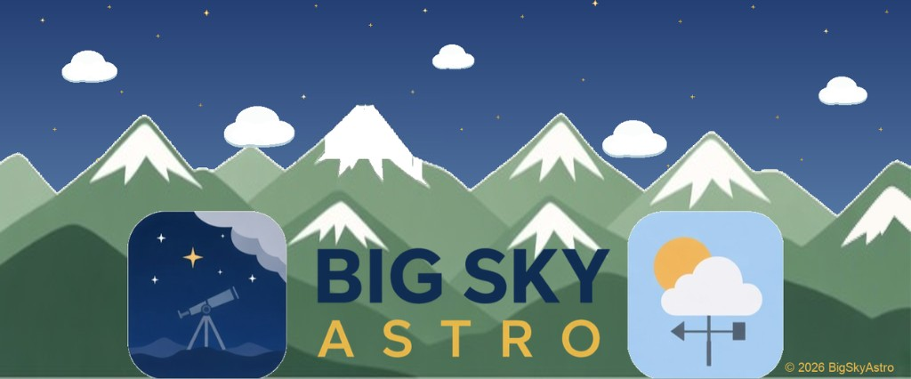
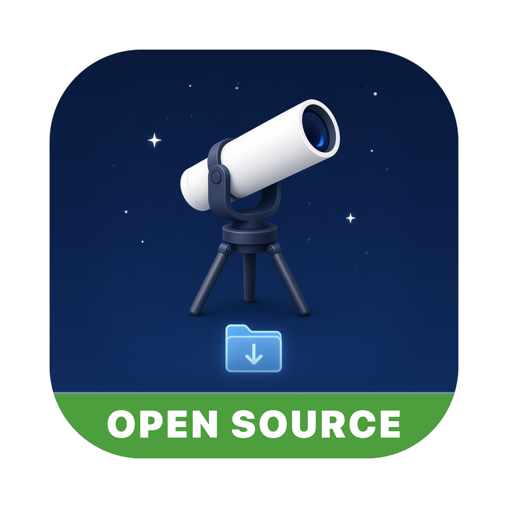

<p align="center">
  <a href="https://bigskyastro.com"></a>
</p>



# Smart Telescope Sort

[](LICENSE)
[](LICENSE)
[](#build)
[](https://bigskyastro.com)

Free, open-source macOS app from [BigSkyAstro](https://bigskyastro.com) that copies smart-telescope captures from a download folder into `Targets {year}/{object}`, checks each copy, and deletes the originals only after you confirm.

## Credit BigSkyAstro

**If you modify and distribute this app, in source or binary form, please give credit to BigSkyAstro: include the BigSkyAstro logo ([`docs/bigskyastro-banner.jpg`](docs/bigskyastro-banner.jpg)) and a link to our web page: [https://bigskyastro.com](https://bigskyastro.com).**

A credit line such as this is enough:

> Based on Smart Telescope Sort by BigSkyAstro — https://bigskyastro.com

The [LICENSE](LICENSE) makes this credit a condition of redistribution.

## What it does

- Detects the capture layout from your Captures folder: dated session folders, object albums, session folders, or object-and-date folders.
- Asks once where your Original Targets, Processing Targets and Backup Storage folders live, with an option to save each as the default.
- Lets you choose which files to sort: TIFF, JPG/JPEG, FITS/FIT, or all of them.
- Before sorting, can back up the capture folders as a zip or tarball using the archiver built into macOS. There is nothing extra to install.
- Lists every file in a review window, with its object, date and target folder, before anything is copied.
- Asks you to name each backup and shows its progress, with a Cancel button.
- Copies each file into Targets, checks the copy byte for byte, and deletes the original only after every copy has succeeded and you say Yes twice.
- Never overwrites a file already in Targets. Only a byte-identical copy counts as a duplicate.
- Remove Identical Copies lists repeated copies already in Targets and asks twice before moving the extras to the Trash.
- After a sort, asks twice before deleting a finished capture folder, and leaves any folder that still holds files it does not recognize.
- On first launch, asks you to accept the terms once. Help → Terms Acceptance Record shows when you agreed.
- The Source code on GitHub link asks for this credit, showing the logo and the bigskyastro.com link, then opens this repository when you click Continue.

Independent app. Not affiliated with or created by telescope manufacturers. Model names in the source identify folder layouts only. A modified build should keep the product name free of those trademarks.

The Mac App Store edition is signed and distributed separately. A build from this repository is your own local copy.

## Build

Requires Xcode command-line tools.

```bash
cd App
chmod +x build-app.sh
./build-app.sh
```

The app is written next to the `App` folder as `Smart Telescope Sort.app`. The script builds a universal binary (Apple silicon and Intel) for macOS 15 or newer and ad-hoc signs it. You do not need an Apple Developer certificate to run your own changes.

Rebuild the bundled manual with:

```bash
python3 App/Scripts/build-user-manual.py
```

That script needs `reportlab`.

## Try it

`Demo Captures/` holds placeholder files, not real images. In the app, set Source Captures to one brand folder, such as `Demo Captures/Seestar`, then press Review file plan.

| Folder | Layout |
|--------|--------|
| `Vaonis/` | Dated session folders |
| `Seestar/` | Object album folders |
| `DWARF/` | Session folders |
| `Origin/` | Object and date folders |

## License

Open source under the MIT License, with an attribution requirement. See [LICENSE](LICENSE).

Copyright (c) 2026 [BigSkyAstro](https://bigskyastro.com).
